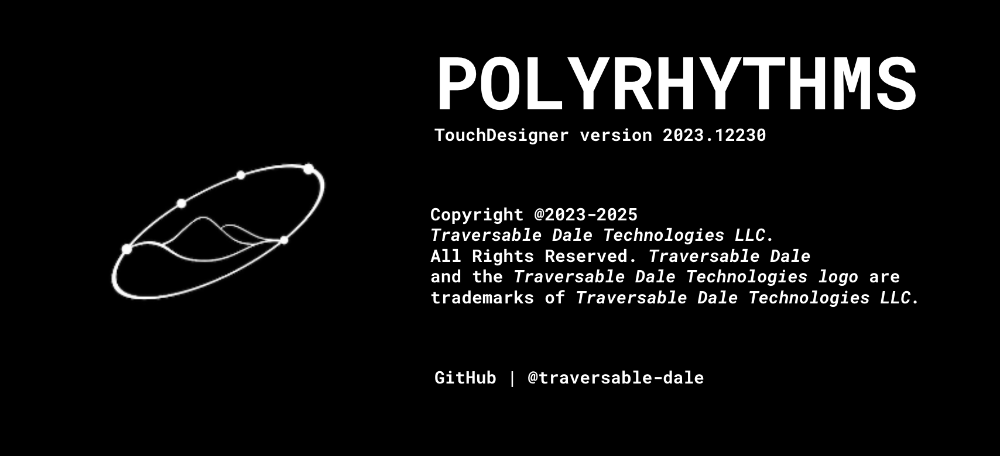

# Polyrhythm Visualizer

This project is a **TouchDesigner-based audiovisual system** that blends *polyrhythmic beats*, *generative visuals*, and *audio playback*.

## 🚀 Startup Flow
1. Launch → Splash screen (`op.splash`)
2. Timers run → handle delays/fades
3. Main program starts → GUI + visuals + audio
