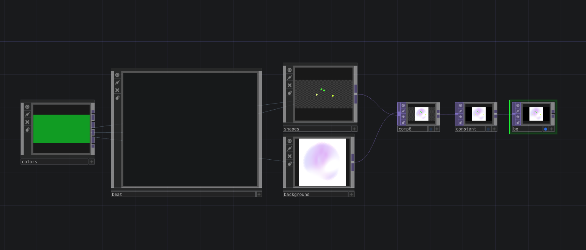
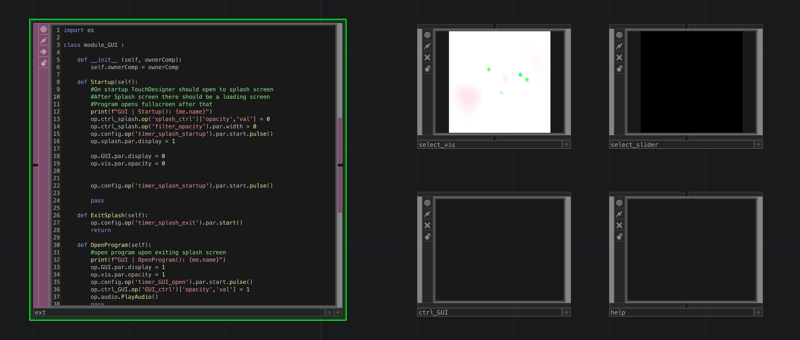
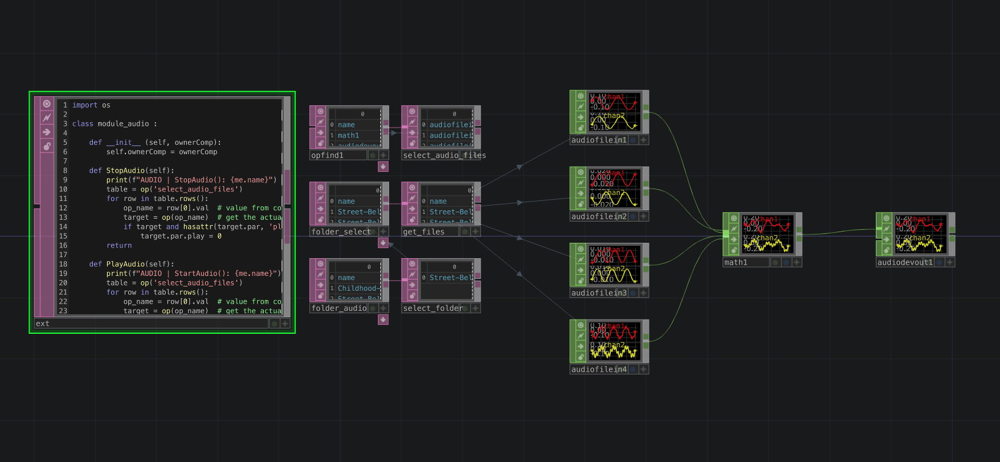
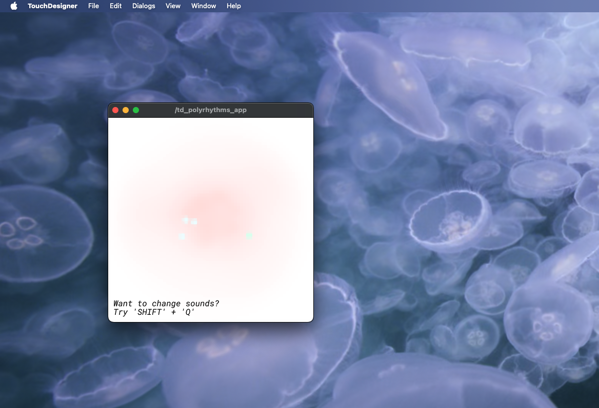

# TD Polyrhythms

This project is a **TouchDesigner-based audiovisual system** that blends *polyrhythmic beats*, *generative visuals*, and *audio playback*.  

It began as an experiment a few years ago, with additional features planned for the future.

---

## 🟦 Network Breakdown

  

- **`op.config`** – *handles onStart logic, holds all timers, controls project resolution*  
  - **Timers inside:**  
    - `timer_splash_startup`  
    - `timer_splash_exit`  
    - `timer_GUI_open`

- **`op.ctrl`** – *user interface and input controls*  
  - **Slider:** `slider_speed` (*adjusts system tempo*)  
  - **Keyboard input:**  
    - Press **`q`** + **`shift`** → cycle through audio folders (inside the main audio folder)  

- **`op.splash`** – *startup splash screen graphic with “Start” button*  

- **`op.vis`** – *main visualization output (TOPs)*  
  - **`op.colors`** – *4 beat-linked colors + 5th background color*  
  - **`op.beat`** – *LFOs and counters driving polyrhythms*  
  - **`op.shapes`** – *circle visuals orbiting a center point, with feedback trails*  
  - **`op.background`** – *dynamic background visuals*  
  - **`op.comp`** – *further compositing; includes look1/look2 switching* 

- **`op.GUI`** – *main program GUI*  
  - **`op.ctrl_GUI`** – *sub-component for GUI-level controls*  
  - **Help Screen** – appears on program start whenever GUI is visible (*trigger-based popup*)  

- **`op.audio`** – *audio playback network with Python extension control*  
  - **`folder_audio`** – *main audio folder reference (externalized parameter)*  
  - *Inside this folder: subfolders by instrument*  
  - *First 4 files from each instrument subfolder are chosen for playback* 

---

## 🟩 Python Extensions

- **`module_GUI.py`** – *manages splash screen and GUI transitions*  
  - `Startup()` – shows splash, initializes timers  
  - `ExitSplash()` – runs exit splash timer  
  - `OpenProgram()` – reveals GUI, fades in visuals, starts audio, shows help screen  

- **`module_audio.py`** – *controls audio operators listed in `select_audio_files`*  
  - `StopAudio()` – stops all audio (`play = 0`)  
  - `PlayAudio()` – starts all audio (`play = 1`)  
  - *Audio folder cycling logic now tied to keyboard input (`q` + `shift`)*  

---

## 🟥 DAT Scripts

- **`chopexec_slider_speed.py`** – *updates tempo when slider changes*  
- **`execute_config.py`** – *startup/shutdown logic in `op.config`*  
- **`timer_GUI_open_callbacks.py`** – *opens GUI after splash*  
- **`timer_splash_wait_callbacks.py`** – *timing delays during splash*  
- **`timer_splash_exit_callbacks.py`** – *handles splash exit logic*  
- **`timer_splash_startup_callbacks.py`** – *startup transition into main program*  

---

## 🟨 Startup Flow

1. **Launch project** → `op.config` calls `Startup()`  
2. **Splash screen appears** → `op.splash` displayed  
3. **Timers run** → delays, fades, and transitions  
4. **Open program** → `OpenProgram()` runs:
   - GUI revealed (`op.GUI`)  
   - Visuals fade in (`op.vis`)  
   - Audio playback begins (`PlayAudio()`)  
   - Help screen pops up (triggered when GUI is True)  

---

## 🟪 Controls

- **`slider_speed`** (*inside `op.ctrl`*) → adjusts polyrhythm tempo  
- **Splash screen button** (*inside `op.splash`*) → starts main program  
- **Keyboard input:**  
  - `q` + `shift` → cycle through audio instrument folders inside `op.audio.op('folder_audio')`  

---

## ⬜ Future Plans
- Expanded user controls (beyond tempo).  
- Additional polyrhythm visual styles.  
- Audio-reactive modes.  
- Modular visual/audio layering options.  
