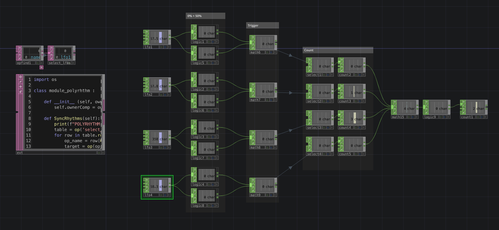

# TD Polyrhythms

I love sound generators. 

Sound generators at home, at work, while traveling- having a familiar sound to fill the void always brings me comfort. There are two creators who I have gone back to over the years and owe inspiration for this work:

Stéphane Pigeon: https://mynoise.net/

Lucid Rhythms: https://www.youtube.com/@LucidRhythms

Polyrhythms have always struck me as something special- existing somewhere between music and random sound. Something like an abstract clock. Predictable, yet chaotic at times.

It's always a joy to get lost in the rhythm, when all of a sudden- the chord!

---

This project is a **TouchDesigner-based audiovisual system** that blends *polyrhythmic beats*, *generative visuals*, and *audio playback*.  

It began as an experiment a few years ago, with additional features planned for the future.

---

## 🟦 Network Breakdown

  

- **`op.config`** – *handles onStart logic, holds all timers, controls project resolution*  
  - **Timers inside:**  
    - `timer_splash_startup`  
    - `timer_splash_exit`  
    - `timer_GUI_open`

- **`op.ctrl`** – *user interface and input controls*  
  - **Slider X:** `slider_speed` (*adjusts polyrhythm speed, 0 → 1*)  
  - **Slider Y:** `insidev` (*adjusts audio filters low + high*)
  - **Keyboard input:**  
    - Press **`q` + `shift`** → cycle through instrument subfolders inside `op.audio.op('folder_audio')`  

- **`op.splash`** – *startup splash screen graphic with “Start” button*  

- **`op.GUI`** – *main program GUI*  
  - **`op.ctrl_GUI`** – *sub-component for GUI-level controls*  
  - **Help Screen** – appears on program start whenever GUI is displayed (*trigger-based popup*)  
  

- **`op.vis`** – *main visualization output (TOPs)*  
  - **`op.colors`** – *4 beat-linked colors + 5th background color*  
  - **`op.shapes`** – *circle visuals orbiting a center point, with feedback trails*  
  - **`op.background`** – *dynamic background visuals*  
  - **`op.comp`** – *further compositing; includes look1/look2 switching*  

- **`op.audio`** – *audio playback network with Python extension control*  
  - **`folder_audio`** – *externalized parameter for the main audio folder*  
  - *Inside this folder: subfolders by instrument*  
  - *First 4 files from each instrument subfolder are chosen for playback*  

- **`op.polyrhythm`** – *core rhythm logic (base level of network)*  
  - **How it works:**  
    - The `slider_speed` value is broken out over 4 nodes in `op.ctrl` and sent to `op.shapes`.  
    - **Rotation multipliers:** `1`, `0.9`, `0.8`, `0.7`  
    - **Distance multipliers:** `1`, `0.8`, `0.6`, `0.4`  
    - Rotation multipliers also drive LFO frequency.  
    - All LFOs are pulsed together on start → frequencies stagger to create the polyrhythm.  
    - Inside, a network of *logic CHOPs* detects when shapes hit **0%** or **50%**.  
    - These events trigger math chains that send signals to **`op.colors`** and **`op.audio`** → driving color changes and sound playback.  
    - Count CHOPs track cycles and advance through colors.  

---

## 🟩 Python Extensions

- **`module_GUI.py`**:contentReference[oaicite:0]{index=0} – *manages splash screen and GUI transitions*  
  - `Startup()` – initializes splash and timers  
  - `ExitSplash()` – runs exit splash timer  
  - `OpenProgram()` – reveals GUI, fades in visuals, starts audio, syncs polyrhythm  

- **`module_audio.py`**:contentReference[oaicite:1]{index=1} – *controls audio operators listed in `select_audio_files`*  
  - `StopAudio()` – stops all audio (`play = 0`)  
  - `PlayAudio()` – starts all audio (`play = 1`)  

- **`module_polyrhythm.py`**:contentReference[oaicite:2]{index=2} – *synchronizes LFOs and rhythm reset*  
  - `SyncRhythms()` – pulses all LFO reset channels listed in `select_lfos`  

---

## 🟥 DAT Scripts

- **`chopexec_slider_speed.py`** – *updates tempo when slider changes*  
- **`execute_config.py`** – *startup/shutdown logic in `op.config`*  
- **`timer_GUI_open_callbacks.py`** – *opens GUI after splash*  
- **`timer_splash_wait_callbacks.py`** – *timing delays during splash*  
- **`timer_splash_exit_callbacks.py`** – *handles splash exit logic*  
- **`timer_splash_startup_callbacks.py`** – *startup transition into main program*  

---

## 🟨 Startup Flow

1. **Launch project** → `op.config` calls `Startup()`  
2. **Splash screen appears** → `op.splash` displayed  
3. **Timers run** → delays, fades, and transitions  
4. **Open program** → `OpenProgram()` runs:
   - GUI revealed (`op.GUI`)  
   - Visuals fade in (`op.vis`)  
   - Audio playback begins (`PlayAudio()`)  
   - Polyrhythm synced (`SyncRhythms()`)  
   - Help screen pops up (triggered when GUI is True)  

---

## 🟪 Controls

- **Splash screen button** (*inside `op.splash`*) → starts main program
- **Slider X:** `slider_speed` (*adjusts polyrhythm speed, 0 → 1*)  
- **Slider Y:** `insidev` (*adjusts audio filters low + high*) 
- **Keyboard input:**  
  - `q` + `shift` → cycle through instrument subfolders inside `op.audio.op('folder_audio')`  

---

## ⬜ Future Plans
- Expanded user controls
- Menu system
- Additional visual styles
- Additional audio samples