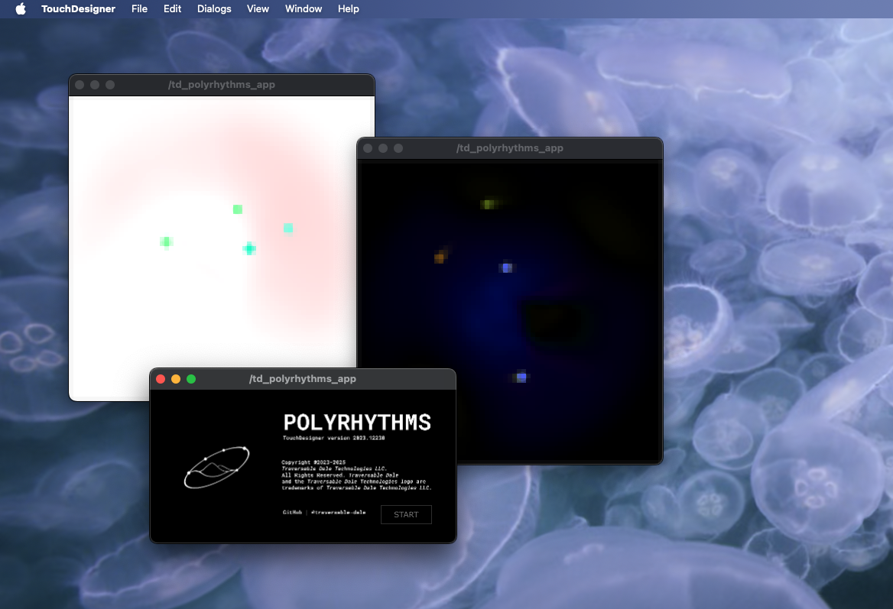
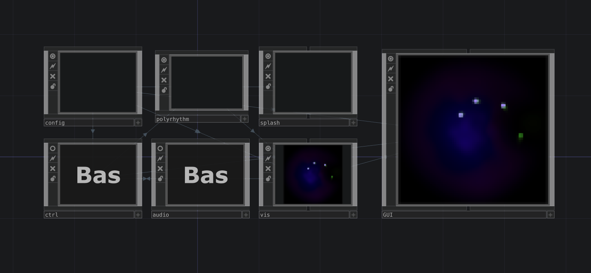
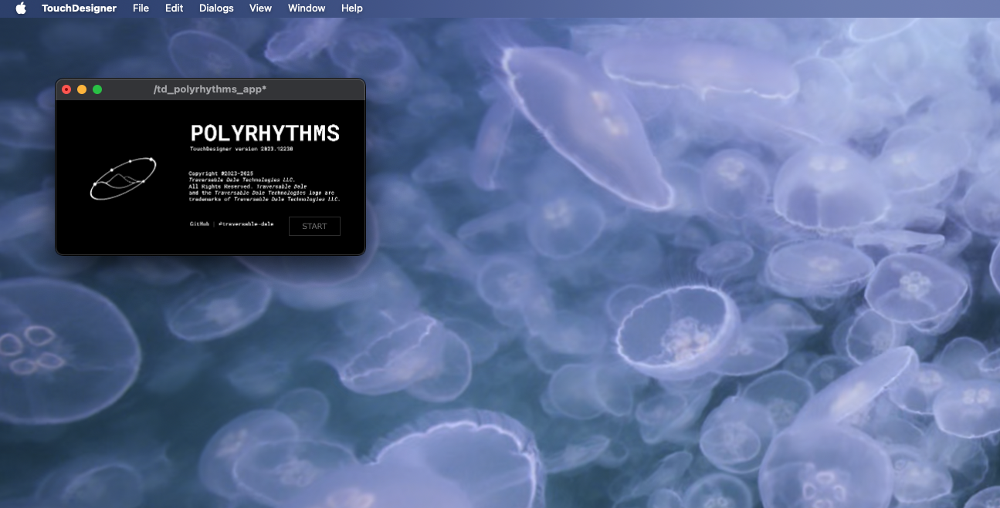

# TD Polyrhythms

This project is a **TouchDesigner-based audiovisual system** that blends *polyrhythmic beats*, *generative visuals*, and *audio playback*.  
It began as an experiment a few years ago, with additional features planned for the future.

---

## 📂 Network Breakdown

- **`op.config`** – *handles onStart logic, holds all timers, controls project resolution*  
  - **Timers inside:**  
    - `timer_splash_startup`  
    - `timer_splash_exit`  
    - `timer_GUI_open`

- **`op.ctrl`** – *UI elements for user control (currently only `slider_speed`)*  

- **`op.vis`** – *main visualization output (TOPs)*  
  - **`op.colors`** – *4 beat-linked colors + 5th background color*  
  - **`op.beat`** – *LFOs and counters driving polyrhythms*  
  - **`op.shapes`** – *circle visuals orbiting a center point, with feedback trails*  
  - **`op.background`** – *dynamic background visuals*  

- **`op.audio`** – *audio playback network with Python extension control*  

- **`op.splash`** – *startup splash screen graphic with “Start” button*  

---

## 🐍 Python Extensions

- **`module_GUI.py`** – *manages splash screen and GUI transitions*  
  - `Test()` – debug function  
  - `Startup()` – shows splash, initializes timers  
  - `ExitSplash()` – runs exit splash timer  
  - `OpenProgram()` – reveals GUI, fades in visuals, starts audio  

- **`module_audio.py`** – *controls audio operators listed in `select_audio_files`*  
  - `StopAudio()` – stops all audio (`play = 0`)  
  - `PlayAudio()` – starts all audio (`play = 1`)  

---

## 📑 DAT Scripts

- **`chopexec_slider_speed.py`** – *updates tempo when slider changes*  
- **`execute_config.py`** – *startup/shutdown logic in `op.config`*  
- **`timer_GUI_open_callbacks.py`** – *opens GUI after splash*  
- **`timer_splash_wait_callbacks.py`** – *timing delays during splash*  
- **`timer_splash_exit_callbacks.py`** – *handles splash exit logic*  
- **`timer_splash_startup_callbacks.py`** – *startup transition into main program*  

---

## 🚀 Startup Flow

1. **Launch project** → `op.config` calls `Startup()`  
2. **Splash screen appears** → `op.splash` displayed  
3. **Timers run** → delays, fades, and transitions  
4. **Open program** → `OpenProgram()` runs:
   - GUI revealed (`op.GUI`)  
   - Visuals fade in (`op.vis`)  
   - Audio playback begins (`PlayAudio()`)  

---

## 🎛 Controls

- **`slider_speed`** (*inside `op.ctrl`*) → adjusts polyrhythm tempo  
- **Splash screen button** (*inside `op.splash`*) → starts main program  

---

## 🖼 Future Plans
- Expanded user controls (beyond tempo).  
- Additional polyrhythm visual styles.  
- Audio-reactive modes.  
- Modular visual/audio layering options.  
